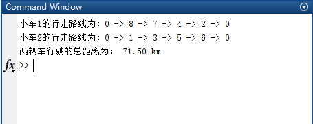

# 遗传算法解决最短路径问题
**实例描述：**

配送中心数为 1，客户数 k 为 8，车辆总数 m 为 2；车辆载重皆为 8 吨；各客户点需求为 g(i = 1, 2, ... , 8)（单位为吨），已知客户点与配送中心的距离如表 1 （其中 0 表示中心仓库），要求合理安排车辆的运输路线，使总运输里程最小。

**客户点与配送中心的距离表：**

| cij  | 0    | 1    | 2    | 3    | 4    | 5    | 6    | 7    | 8    |
| ---- | ---- | ---- | ---- | ---- | ---- | ---- | ---- | ---- | ---- |
| 0    | 0    | 4    | 6    | 7.5  | 9    | 20   | 10   | 16   | 8    |
| 1    | 4    | 0    | 6.5  | 4    | 10   | 5    | 7.5  | 11   | 10   |
| 2    | 6    | 6.5  | 0    | 7.5  | 10   | 10   | 7.5  | 7.5  | 7.5  |
| 3    | 7.5  | 4    | 7.5  | 0    | 10   | 5    | 9    | 9    | 15   |
| 4    | 9    | 10   | 10   | 10   | 0    | 10   | 7.5  | 7.5  | 10   |
| 5    | 20   | 5    | 10   | 5    | 10   | 0    | 7    | 9    | 7.5  |
| 6    | 10   | 7.5  | 7.5  | 9    | 7.5  | 7    | 0    | 7    | 10   |
| 7    | 16   | 11   | 7.5  | 6    | 7.5  | 9    | 7    | 0    | 10   |
| 8    | 8    | 10   | 7.5  | 15   | 10   | 7.5  | 10   | 10   | 0    |

**各客户点需求：**

| g1   | g2   | g3   | g4   | g5   | g6   | g7   | g8   |
| ---- | ---- | ---- | ---- | ---- | ---- | ---- | ---- |
| 1    | 2    | 1    | 2    | 1    | 4    | 2    | 2    |

**运行结果：**

【Attention】下图并非最优结果，只是为了测试程序的正确性。可以尝试加大次数改良结果。

